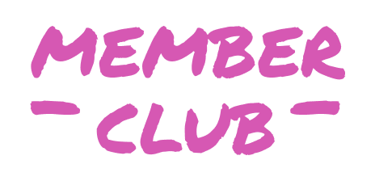
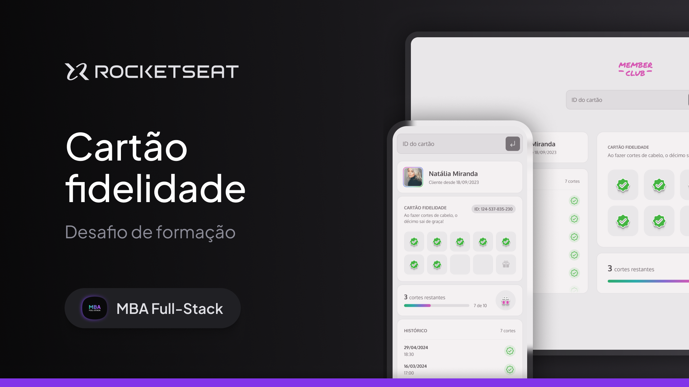

  
    

## 📖 Sobre

Projeto 10 do [MBA Rocketseat Full-stack](https://www.rocketseat.com.br/mba) como desafio do módulo **Fundamentos do Desenvolvimento Web**.

  
    

 

## 🎨 Protótipo

Protótipo do projeto foi desenvolvido no Figma e pode ser acessado [aqui](files/prototype.fig) (by [Rocketseat](https://github.com/rocketseat) ❤️).

 

## 🚀 Visualizar o Projeto

O projeto poderá ser visualizado [aqui](https://danilosalvador.github.io/member-club/dist/index.html).

Utilize os IDs abaixo para abrir outros usuários:

- 124-537-835-230 (carregado inicialmente)
- 207-245-699-104
- 523-114-876-908

 

## 📝 Licença
Esse projeto está sob a licença MIT. Veja o arquivo [LICENSE](LICENSE) para mais detalhes.